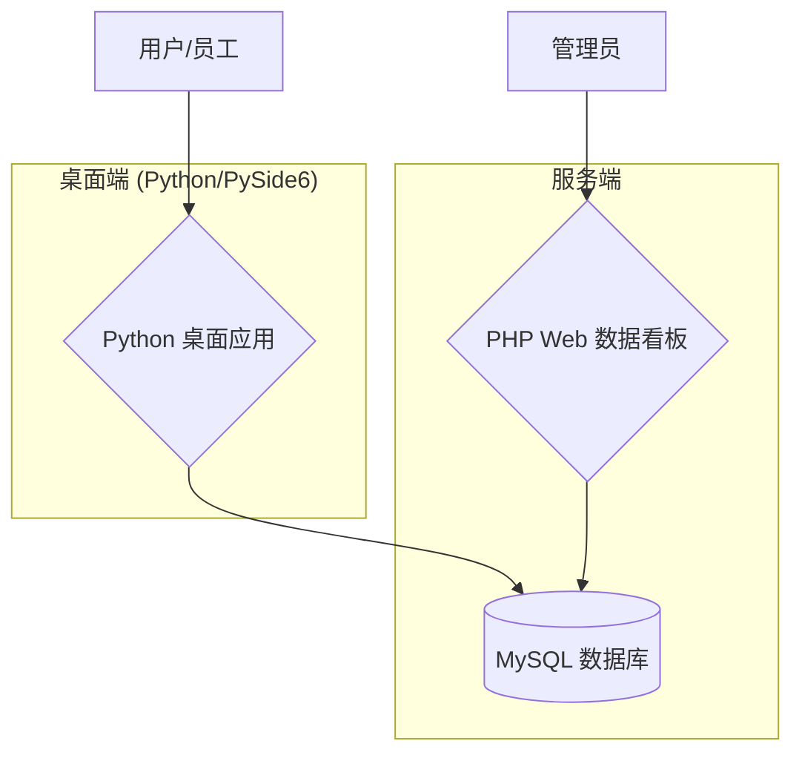

# 工单管理系统 - 说明书与维护手册

## 1. 项目概述

本项目是一个专为多角色、多部门协作设计的工单管理系统。它由一个基于 **PySide6** 的桌面应用程序和一个 **PHP** 开发的现代化数据看板网站组成，后端共享同一个 **MySQL** 数据库。

系统旨在简化和自动化工单处理流程，涵盖从工单创建、分配、处理到完成的全过程，并提供强大的数据可视化和分析功能，帮助管理者洞察业务状态。

### 1.1. 主要组件

1.  **Python 桌面应用 (`main.py`)**: 核心操作界面，供内部员工使用，支持不同角色（采购、摄影、美工、剪辑、运营、销售）的工作流程。
2.  **PHP 数据看板 (`web/`)**: 一个独立的现代化网站，为管理员提供数据总览、工单列表查询和深度数据分析。
3.  **MySQL 数据库**: 系统的统一数据存储中心，所有桌面应用和Web看板的数据都来源于此。

### 1.2. 系统架构



---

## 2. 功能介绍

### 2.1. 桌面应用功能

-   **多角色登录与权限控制**: 系统预设多种角色，不同角色拥有不同的操作界面和权限。
-   **动态工单管理**:
    -   支持按部门筛选和查看工单。
    -   实时更新工单状态。
    -   双击工单可查看完整详情和历史操作日志。
-   **精细化操作弹窗**: 为每个核心角色（摄影、剪辑、运营、销售等）设计了专属的操作弹窗。
-   **文件路径管理**: 支持添加文件/文件夹路径，并支持双击直接打开。
-   **产品信息管理**: 运营角色可以为工单添加相关的产品上架信息（标题、关键词、URL），并支持双击打开链接。
-   **自动化日志记录**: 所有关键操作都会被自动记录，包括操作人、操作类型、详情和IP地址。
-   **管理员日志中心**: 管理员可以查看系统中所有用户的详细操作日志。

### 2.2. Web 数据看板功能

-   **安全登录**: 管理员通过独立密码登录访问。
-   **现代化数据看板 (`index.php`)**:
    -   采用 Apple/Nike 风格设计，UI/UX 优良。
    -   实时显示核心指标：总工单数、总日志数、部门总数等。
    -   使用 Chart.js 动态展示近期工单趋势和日志活动图表。
-   **高级工单列表 (`orders.php`)**:
    -   卡片式设计，一行一个工单，布局紧凑。
    -   支持点击卡片异步加载并展开工单详情，自动关闭其他已展开项。
    -   强大的筛选功能：支持按工单ID、型号、名称、发起人、部门、状态进行搜索和筛选。
-   **深度数据分析 (`analytics.php`)**:
    -   支持按周、月、年切换时间范围进行数据分析。
    -   提供多维度分析图表：工单趋势、角色活动、状态分布、部门效率、操作类型等。
    -   提供详细的部门效率分析表格，包含效率评级。

---

## 3. 安装与配置指南

### 3.1. 环境要求

-   **Python 环境**: Python 3.8+
-   **Web 服务器**: 支持 PHP 7.4+ 的 Web 服务器 (如 Nginx, Apache)。
-   **数据库**: MySQL 5.7+ 或 MariaDB 10.2+。

### 3.2. 桌面应用配置

1.  **克隆项目**:
    ```bash
    git clone [your-repository-url]
    cd pyproj
    ```

2.  **安装 Python 依赖**:
    ```bash
    pip install -r requirements.txt
    ```
    `requirements.txt` 文件内容应至少包括:
    ```
    PySide6
    pymysql
    netifaces
    ```

3.  **配置数据库连接**:
    打开 `database.py` 文件，修改 `__init__` 方法中的数据库连接信息：
    ```python
    self.config = {
        'host': 'your_db_host',       # 数据库主机地址
        'database': 'your_db_name',  # 数据库名称
        'user': 'your_db_user',      # 数据库用户名
        'password': 'your_db_password',# 数据库密码
        'charset': 'utf8mb4',
        'autocommit': True
    }
    ```

4.  **初始化数据库**:
    首次运行 `main.py` 会自动连接数据库并创建所需的表结构和默认数据（角色、部门等）。确保提供的数据库用户拥有 `CREATE TABLE`, `INSERT`, `SELECT`, `UPDATE`, `DELETE` 权限。

5.  **运行应用**:
    ```bash
    python main.py
    ```

### 3.3. Web 数据看板配置

1.  **部署文件**:
    将项目中的 `web` 文件夹上传到你的 Web 服务器的网站根目录。

2.  **配置数据库连接与密码**:
    打开 `web/config.php` 文件，修改以下配置：
    ```php
    // 数据库配置
    define('DB_HOST', 'your_db_host');       // 必须与 database.py 中一致
    define('DB_NAME', 'your_db_name');      // 必须与 database.py 中一致
    define('DB_USER', 'your_db_user');      // 必须与 database.py 中一致
    define('DB_PASS', 'your_db_password');  // 必须与 database.py 中一致

    // 管理员密码
    define('ADMIN_PASSWORD', 'your_dashboard_password'); // 设置一个安全的访问密码
    ```

3.  **访问看板**:
    通过浏览器访问 `http://your-domain.com/login.php`，输入设定的管理员密码即可登录。

---

## 4. 使用说明

### 4.1. 桌面应用

1.  **选择角色与部门**: 启动应用后，首先选择你的角色和所属部门。
2.  **主界面**:
    -   左侧是部门列表，点击可筛选工单。
    -   右侧是工单列表，显示工单基本信息。
    -   双击任意工单，会弹出该工单的详细信息弹窗，包含所有历史日志。
3.  **操作工单**:
    -   在主界面选择一个或多个工单。
    -   点击右下角对应角色的操作按钮（如"摄影办理"），打开操作弹窗。
    -   在弹窗中完成相应操作（如更新状态、添加路径、填写产品信息等）并保存。

### 4.2. Web 数据看板

1.  **登录**: 访问 `login.php` 页面，输入密码登录。
2.  **数据看板 (`index.php`)**: 登录后默认进入此页面，提供核心数据的概览和图表。
3.  **工单列表 (`orders.php`)**:
    -   使用顶部的筛选栏进行精确搜索。
    -   点击任意工单卡片，即可在下方展开该工单的详细信息和操作日志。
4.  **数据分析 (`analytics.php`)**:
    -   选择"本周"、"本月"或"本年"范围。
    -   页面会自动加载并显示该时间范围内的多维度分析报告。

---

## 5. 维护手册

### 5.1. 数据库维护

-   **备份**: 建议定期使用 `mysqldump` 或其他数据库管理工具备份整个数据库。
    ```bash
    mysqldump -u [user] -p [database_name] > backup.sql
    ```
-   **恢复**:
    ```bash
    mysql -u [user] -p [database_name] < backup.sql
    ```
-   **表结构**: 所有表的结构定义在 `database.py` 的 `init_database` 方法中。如果需要修改表结构（如添加字段），需要同时修改 `CREATE TABLE` 语句和相关的 `INSERT`/`UPDATE` 逻辑。

### 5.2. 代码结构

-   `main.py`: **程序主入口**。负责初始化应用、显示主窗口、协调其他UI模块。
-   `database.py`: **数据库核心**。管理所有数据库连接、增删改查操作以及数据库初始化。
-   `clear_data.py`: 用于清空并重新初始化数据库的独立脚本。
-   `ui/`: **UI模块文件夹**。
    -   `main_window.py`: 主窗口的UI和逻辑。
    -   `character_selection.py`: 角色和部门选择窗口。
    -   其他 `*.py` 文件: 各个角色操作弹窗的UI和逻辑。
-   `web/`: **Web看板文件夹**。
    -   `config.php`: 数据库连接和密码配置。
    -   `login.php`, `logout.php`: 登录和登出逻辑。
    -   `index.php`, `orders.php`, `analytics.php`: 各个页面的核心文件。
    -   `assets/`: 存放CSS等静态资源。

### 5.3. 故障排除

-   **桌面应用无法启动**:
    1.  检查 `requirements.txt` 中的依赖是否已全部安装。
    2.  运行 `python main.py` 并查看终端是否有错误信息。

-   **数据库连接失败**:
    1.  确认 `database.py` 和 `web/config.php` 中的数据库凭据是否正确。
    2.  确认数据库服务是否正在运行，并且网络连接正常。
    3.  确认数据库用户是否被授权从应用所在IP地址进行连接。

-   **Web页面显示500错误**:
    1.  检查Web服务器的错误日志（如 Nginx 的 `error.log`）。
    2.  在 `analytics.php` 或 `orders.php` 的开头临时添加以下代码以显示PHP错误：
        ```php
        error_reporting(E_ALL);
        ini_set('display_errors', 1);
        ```
    3.  最常见错误是SQL查询中的列名歧义或语法错误，请仔细检查相关代码。

-   **数据不显示或不正确**:
    1.  直接连接数据库，检查对应的表中是否有数据。
    2.  检查Python或PHP代码中的SQL查询语句是否正确。

### 5.4. 系统扩展

-   **如何添加一个新角色**:
    1.  在 `database.py` 的 `default_roles` 列表中添加新角色名。
    2.  在 `ui/` 目录下，为新角色创建一个新的操作弹窗 `.py` 文件。
    3.  在 `ui/main_window.py` 中，添加新角色的按钮，并连接到新弹窗的逻辑。

-   **如何添加一个新部门**:
    1.  在 `database.py` 的 `default_departments` 列表中添加新部门名。
    2.  重新运行 `main.py` 以将新部门插入数据库（或手动`INSERT`）。系统会自动在UI中显示。


    